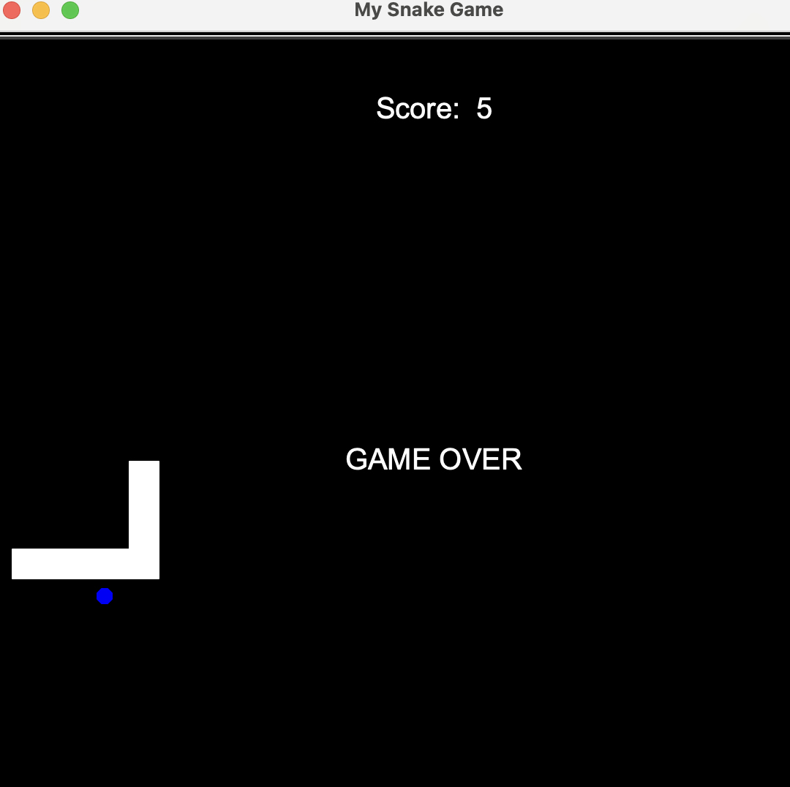
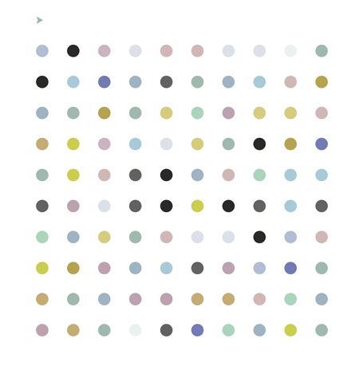

# python-projects
A personal repo for learning and experimentation.

### [snake_game - 20240924](https://github.com/mirella4real/python-projects/tree/main/snake_game)

Recreated the snake game. Intermediate project from the [Appbrewery 100 Days of Code](https://www.udemy.com/course/100-days-of-code/) course.

### [turtle_race - 20240923](https://github.com/mirella4real/python-projects/tree/main/turtle_race)

Kind of loving these turtles! A turtle race (randomly generated turtle instances, random colors, moving at random speeds). Intermediate project from the [Appbrewery 100 Days of Code](https://www.udemy.com/course/100-days-of-code/) course.

### [more_turtle_graphics - 20240923](https://github.com/mirella4real/python-projects/tree/main/more_turtle_graphics)

Further exploration of the Turgle Graphics library. Learned about event listeners and higher order functions in Python. Intermediate project from the [Appbrewery 100 Days of Code](https://www.udemy.com/course/100-days-of-code/) course.

### [hirst_painting - 20240921](https://github.com/mirella4real/python-projects/tree/main/hirst_painting)

Replicated a Hirst dot painting using colorgram and turtle libraries. Intermediate project from the [Appbrewery 100 Days of Code](https://www.udemy.com/course/100-days-of-code/) course.

### [turtle_graphics - 20240920](https://github.com/mirella4real/python-projects/tree/main/turtle_graphics)

Learned how to set up my environment and how to import packages. Intermediate project from the [Appbrewery 100 Days of Code](https://www.udemy.com/course/100-days-of-code/) course.

### [quiz_game - 20240917](https://github.com/mirella4real/python-projects/tree/main/quiz_game)

A simple OOP quiz game. Intermediate project from the [Appbrewery 100 Days of Code](https://www.udemy.com/course/100-days-of-code/) course.

- With this project I learned how to write classes in Python.

### [coffee_machine_v2 - 20240916](https://github.com/mirella4real/python-projects/tree/main/coffee_machine_v2)

An OOP version of the CLI coffee machine project. Intermediate project from the [Appbrewery 100 Days of Code](https://www.udemy.com/course/100-days-of-code/) course.

### [coffee_machine - 20240913](https://github.com/mirella4real/python-projects/tree/main/coffee_machine)

A CLI coffee machine. Intermediate project with input validation and some unit tests. From the [Appbrewery 100 Days of Code](https://www.udemy.com/course/100-days-of-code/) course.

- pending: more unit tests.

### [high-low game - 20240911](https://github.com/mirella4real/python-projects/tree/main/high-low)

A simple CLI high-low game. With input validation. From the [Appbrewery 100 Days of Code](https://www.udemy.com/course/100-days-of-code/) course.

- pending: unit tests.

### [number-guessing-game - 20240909](https://github.com/mirella4real/python-projects/tree/main/number-guessing-game)

A simple CLI number guessing game. Scope, constants and single responsibility. From the [Appbrewery 100 Days of Code](https://www.udemy.com/course/100-days-of-code/) course.

### [blackjack - 20240828](https://github.com/mirella4real/python-projects/tree/main/blackjack)

A basic CLI blackjack game with unit tests. From the [Appbrewery 100 Days of Code](https://www.udemy.com/course/100-days-of-code/) course.

### [calculator - 20240827](https://github.com/mirella4real/python-projects/tree/main/calculator)

A beginner excercise for learning recursion in python, from the [Appbrewery 100 Days of Code](https://www.udemy.com/course/100-days-of-code/) course.

- pending: input validation, unit tests

### [silent-auction - 20240826](https://github.com/mirella4real/python-projects/tree/main/silent-auction)

A beginner excercise for learning dictionaries in python, from the [Appbrewery 100 Days of Code](https://www.udemy.com/course/100-days-of-code/) course.

- pending: input validation, unit tests
