# python-projects
A personal repo for learning and experimentation.

### [stock-trading-news-alert - 20250109](https://github.com/mirella4real/python-projects/tree/main/stock-trading-news-alert)

Retrieve stock closing price. If closing price is 5% higher or lower, retrieve the three latest news areticles and send a WhatsApp message with a stock news alert. This project leverages Twilio, NewsAPI and AphaVantage APIs.  Intermediate+ project from the [Appbrewery 100 Days of Code](https://www.udemy.com/course/100-days-of-code/) course.

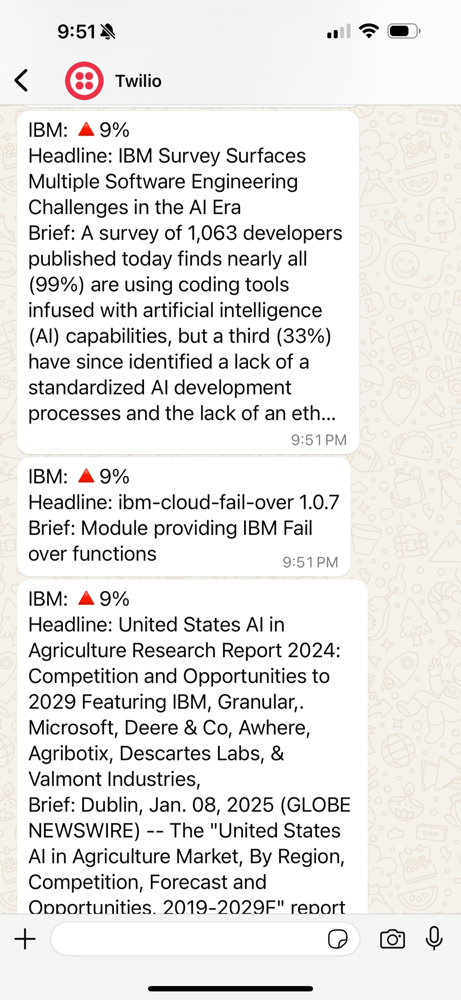

### [rain-alert - 20250104](https://github.com/mirella4real/python-projects/tree/main/rain-alert)

Send a WhatsApp message with a rain alert using Twilio and Open Weather Map API.  Intermediate+ project from the [Appbrewery 100 Days of Code](https://www.udemy.com/course/100-days-of-code/) course.

### [quizzler_app - 20250101](https://github.com/mirella4real/python-projects/tree/main/quizzler_app)

Created a quiz app that connects to the Open Trivia API.  Intermediate+ project from the [Appbrewery 100 Days of Code](https://www.udemy.com/course/100-days-of-code/) course.

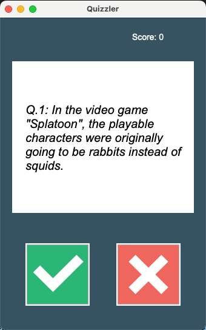

### [iss_overhead_notifier - 20241216](https://github.com/mirella4real/python-projects/tree/main/iss_overhead_notifier)

Using the API from http://open-notify.org/, obtain data from NASA to track the ISS, determine if it is visible from my location and send an email alert.  Intermediate+ project from the [Appbrewery 100 Days of Code](https://www.udemy.com/course/100-days-of-code/) course.

### [birthday_wisher - 20241213](https://github.com/mirella4real/python-projects/tree/main/birthday_wisher)

Read a csv file with people's birthdays and send a birthday greeting via email any birthdays fall on current date.  Intermediate+ project from the [Appbrewery 100 Days of Code](https://www.udemy.com/course/100-days-of-code/) course.

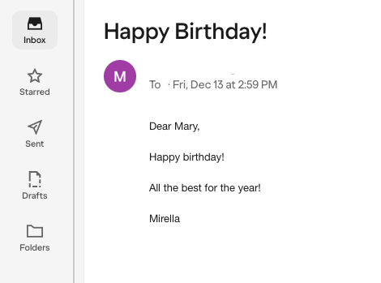

### [motivational_quotes - 20241211](https://github.com/mirella4real/python-projects/tree/main/motivational_quotes)

Send a weekly motivational quote via email.  Intermediate+ project from the [Appbrewery 100 Days of Code](https://www.udemy.com/course/100-days-of-code/) course.

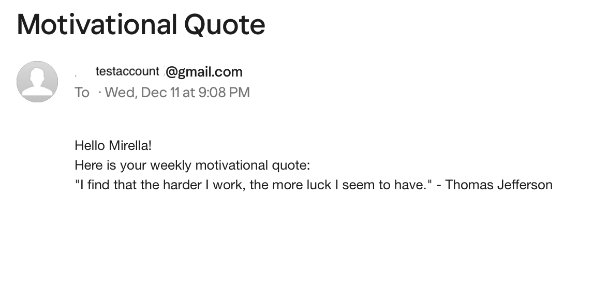

### [flashcard_app - 20241208](https://github.com/mirella4real/python-projects/tree/main/flashcard_app)

Project using Tkinter and Pandas. A flashcard app that keeps track of which words have not been learned.  Intermediate Capstone project from the [Appbrewery 100 Days of Code](https://www.udemy.com/course/100-days-of-code/) course.

Pending: Handling when all words have been learned.

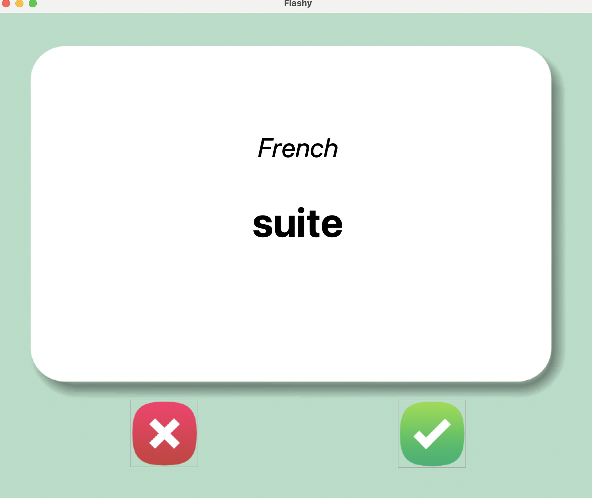

### [tkinter_password_manager_v2 - 20241126](https://github.com/mirella4real/python-projects/tree/main/tkinter_password_manager_v2)

Project using Tkinter. Iterated on the password manager app. Added exception handling, saving and retrieving json data, search functionality and used Gen AI to document functions. Intermediate project from the [Appbrewery 100 Days of Code](https://www.udemy.com/course/100-days-of-code/) course.

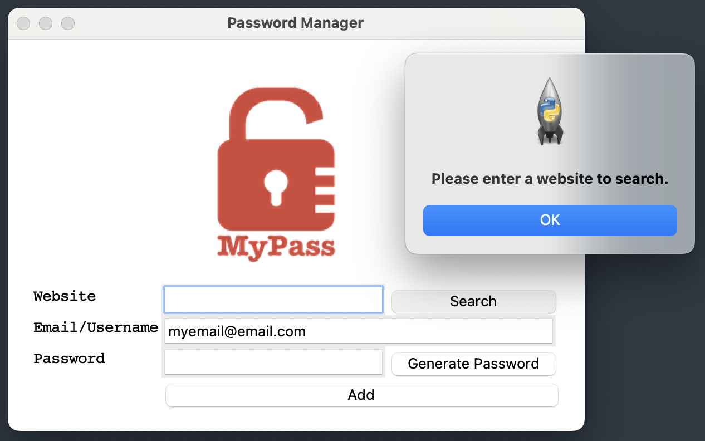

### [tkinter_password_manager - 20241121](https://github.com/mirella4real/python-projects/tree/main/tkinter_password_manager)

Project using Tkinter. Created a password manager app. Learned more about labels, input fields, buttons, dialog boxes and validation. The app generates random passwords, copies to clipboard and saves to a txt file. Intermediate project from the [Appbrewery 100 Days of Code](https://www.udemy.com/course/100-days-of-code/) course.

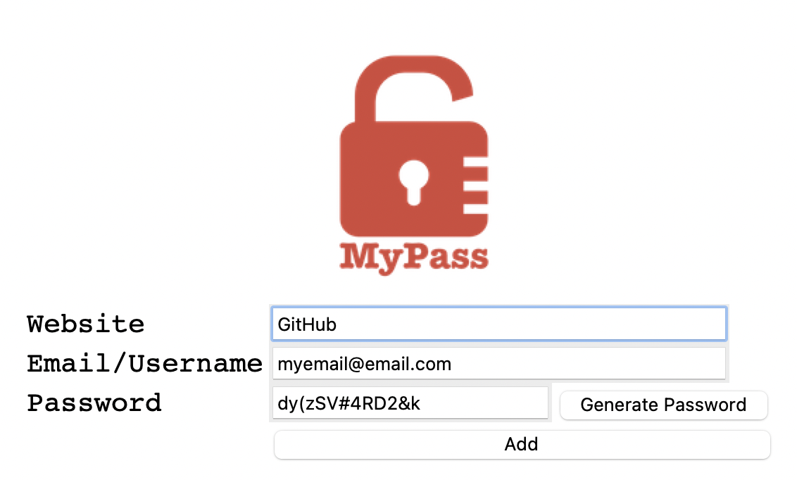

### [tkinter_pomodoro_app - 20241104](https://github.com/mirella4real/python-projects/tree/main/tkinter_pomodoro_app)

Project using Tkinter. Created a timer app that leverages the pomodoro concept. Intermediate project from the [Appbrewery 100 Days of Code](https://www.udemy.com/course/100-days-of-code/) course.

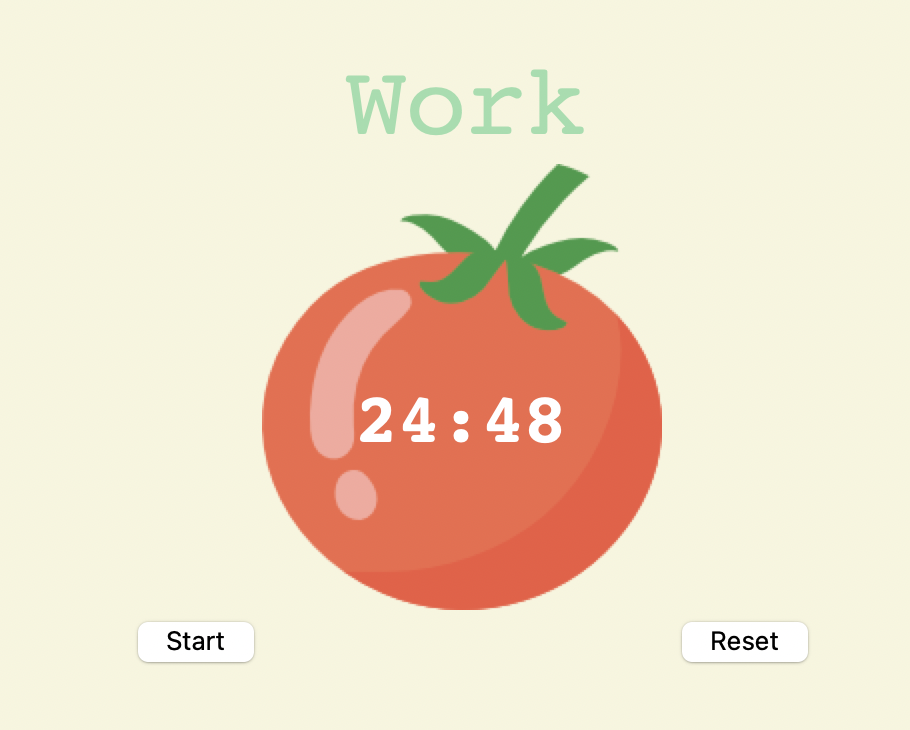

### [mile_to_km_converter - 20241023](https://github.com/mirella4real/python-projects/tree/main/mile_to_km_converter)

Project using Tkinter. Created a mile to km converter using Tkinter. Intermediate project from the [Appbrewery 100 Days of Code](https://www.udemy.com/course/100-days-of-code/) course.

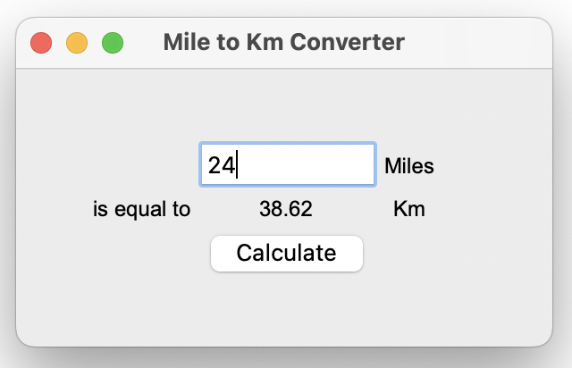

### [nato_alphabet - 20241022](https://github.com/mirella4real/python-projects/tree/main/nato_alphabet)

Project using Pandas, list comprehension and dictionary comprehention to translate a string into a list of NATO phonetic alphabet items. Intermediate project from the [Appbrewery 100 Days of Code](https://www.udemy.com/course/100-days-of-code/) course.

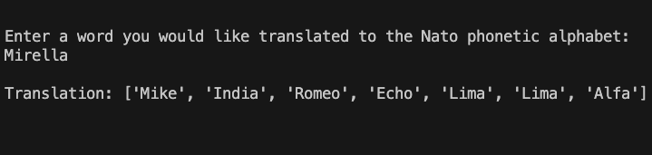

### [us_states_game - 20241014](https://github.com/mirella4real/python-projects/tree/main/us_states_game)

Fun with Pandas library! Can you remember the names of all US states? Intermediate project from the [Appbrewery 100 Days of Code](https://www.udemy.com/course/100-days-of-code/) course.

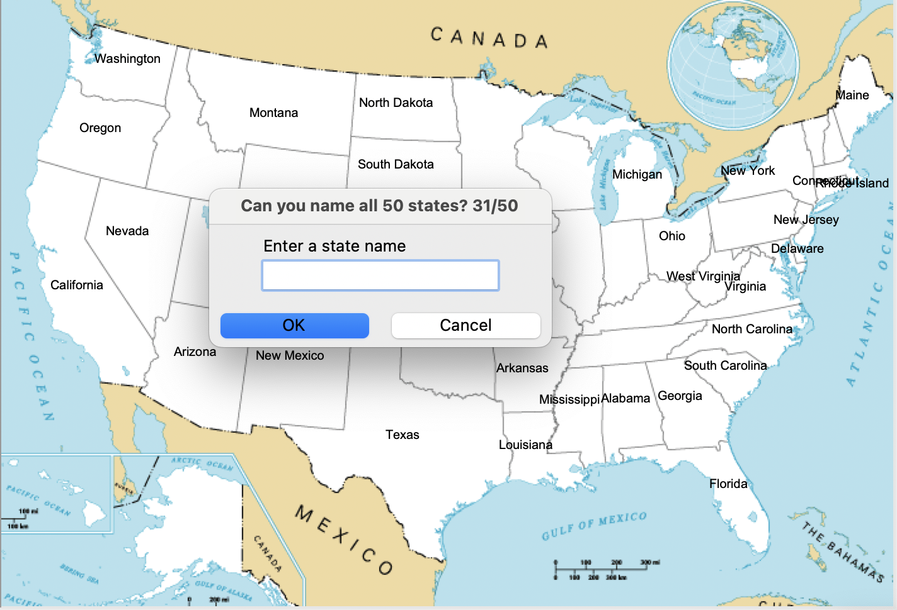

### [mail_merge - 20241011](https://github.com/mirella4real/python-projects/tree/main/mail_merge)

Learned how to read from a list in a file and combine with a template in another file. Intermediate project from the [Appbrewery 100 Days of Code](https://www.udemy.com/course/100-days-of-code/) course.

### [snake_game_plus - 20241010](https://github.com/mirella4real/python-projects/tree/main/snake_game_plus)

Updated the snake game to leverage read/write functionality to keep a high score. Intermediate project from the [Appbrewery 100 Days of Code](https://www.udemy.com/course/100-days-of-code/) course.

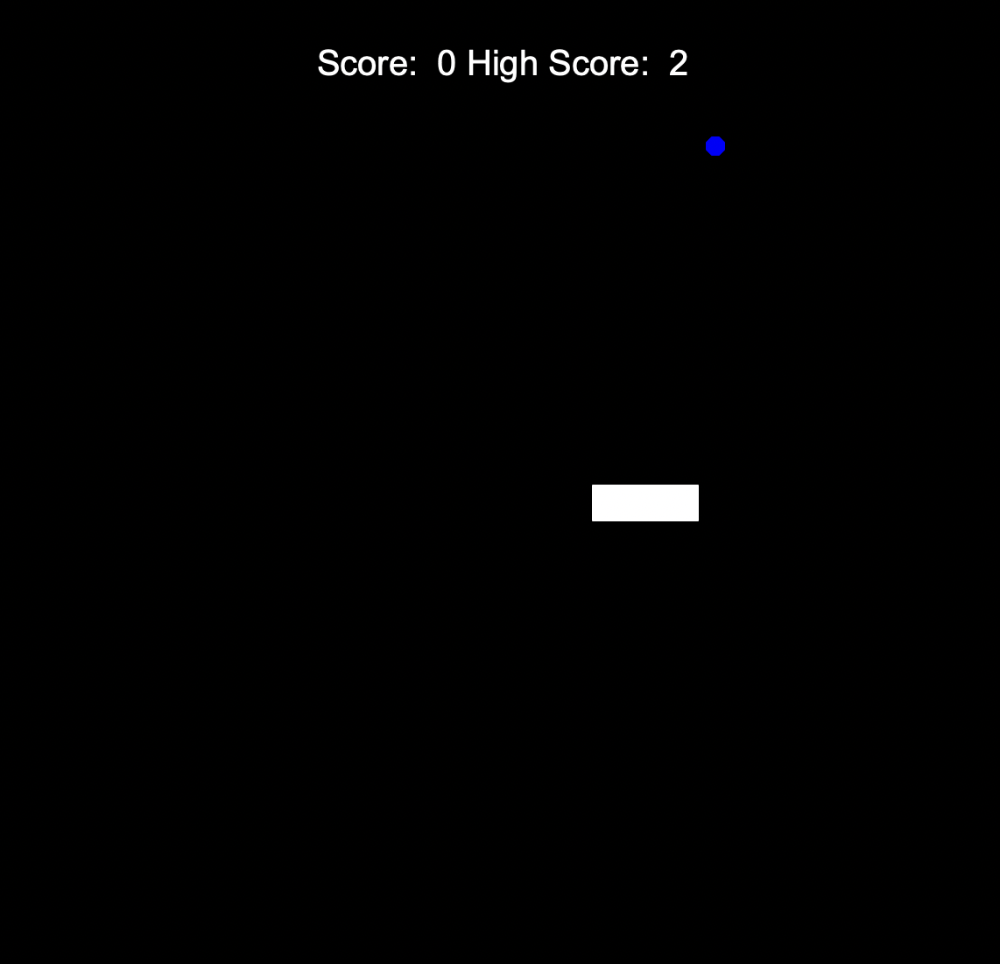

### [turtle_crossing - 20241009](https://github.com/mirella4real/python-projects/tree/main/turtle_crossing)

Capstone project. Recreated the turtle crossing game. Intermediate project from the [Appbrewery 100 Days of Code](https://www.udemy.com/course/100-days-of-code/) course.

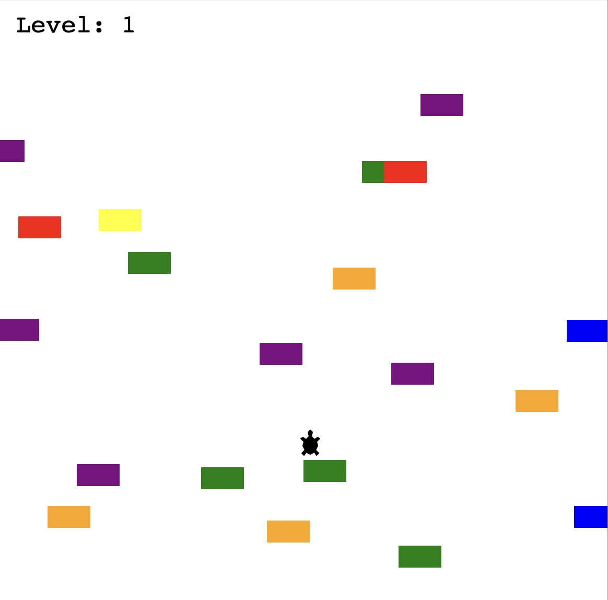

### [pong_game - 20240930](https://github.com/mirella4real/python-projects/tree/main/pong_game)

Recreated Pong. Practicing classes and inheritance. Leveraging class inheritance. Intermediate project from the [Appbrewery 100 Days of Code](https://www.udemy.com/course/100-days-of-code/) course.

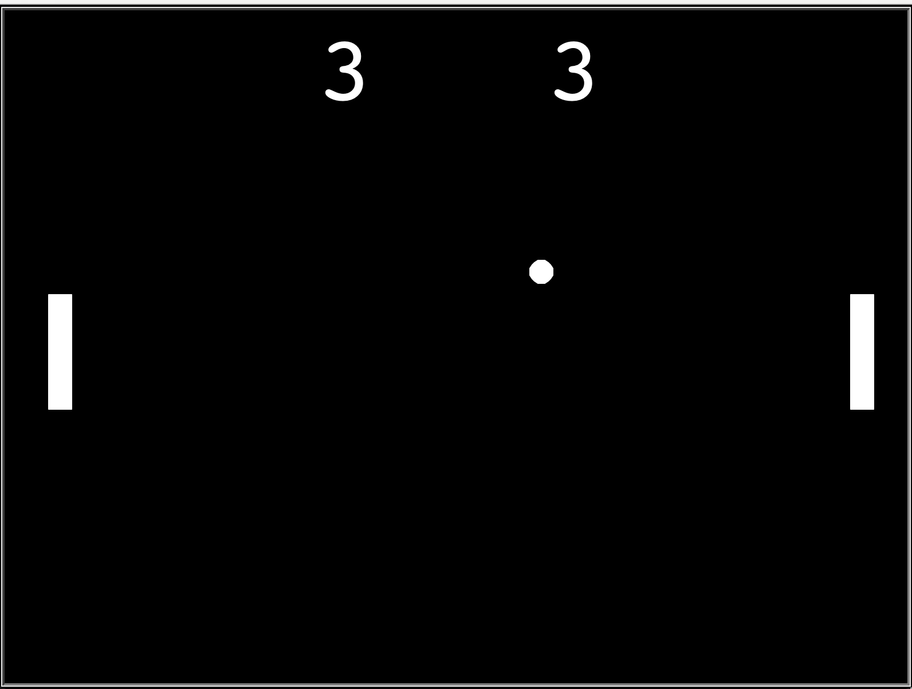

### [snake_game - 20240924](https://github.com/mirella4real/python-projects/tree/main/snake_game)

Recreated the snake game. Intermediate project from the [Appbrewery 100 Days of Code](https://www.udemy.com/course/100-days-of-code/) course.

### [turtle_race - 20240923](https://github.com/mirella4real/python-projects/tree/main/turtle_race)

Kind of loving these turtles! A turtle race (randomly generated turtle instances, random colors, moving at random speeds). Intermediate project from the [Appbrewery 100 Days of Code](https://www.udemy.com/course/100-days-of-code/) course.

### [more_turtle_graphics - 20240923](https://github.com/mirella4real/python-projects/tree/main/more_turtle_graphics)

Further exploration of the Turgle Graphics library. Learned about event listeners and higher order functions in Python. Intermediate project from the [Appbrewery 100 Days of Code](https://www.udemy.com/course/100-days-of-code/) course.

### [hirst_painting - 20240921](https://github.com/mirella4real/python-projects/tree/main/hirst_painting)

Replicated a Hirst dot painting using colorgram and turtle libraries. Intermediate project from the [Appbrewery 100 Days of Code](https://www.udemy.com/course/100-days-of-code/) course.

### [turtle_graphics - 20240920](https://github.com/mirella4real/python-projects/tree/main/turtle_graphics)

Learned how to set up my environment and how to import packages. Intermediate project from the [Appbrewery 100 Days of Code](https://www.udemy.com/course/100-days-of-code/) course.

### [quiz_game - 20240917](https://github.com/mirella4real/python-projects/tree/main/quiz_game)

A simple OOP quiz game. Intermediate project from the [Appbrewery 100 Days of Code](https://www.udemy.com/course/100-days-of-code/) course.

- With this project I learned how to write classes in Python.

### [coffee_machine_v2 - 20240916](https://github.com/mirella4real/python-projects/tree/main/coffee_machine_v2)

An OOP version of the CLI coffee machine project. Intermediate project from the [Appbrewery 100 Days of Code](https://www.udemy.com/course/100-days-of-code/) course.

### [coffee_machine - 20240913](https://github.com/mirella4real/python-projects/tree/main/coffee_machine)

A CLI coffee machine. Intermediate project with input validation and some unit tests. From the [Appbrewery 100 Days of Code](https://www.udemy.com/course/100-days-of-code/) course.

- pending: more unit tests.

### [high-low game - 20240911](https://github.com/mirella4real/python-projects/tree/main/high-low)

A simple CLI high-low game. With input validation. From the [Appbrewery 100 Days of Code](https://www.udemy.com/course/100-days-of-code/) course.

- pending: unit tests.

### [number-guessing-game - 20240909](https://github.com/mirella4real/python-projects/tree/main/number-guessing-game)

A simple CLI number guessing game. Scope, constants and single responsibility. From the [Appbrewery 100 Days of Code](https://www.udemy.com/course/100-days-of-code/) course.

### [blackjack - 20240828](https://github.com/mirella4real/python-projects/tree/main/blackjack)

A basic CLI blackjack game with unit tests. From the [Appbrewery 100 Days of Code](https://www.udemy.com/course/100-days-of-code/) course.

### [calculator - 20240827](https://github.com/mirella4real/python-projects/tree/main/calculator)

A beginner excercise for learning recursion in python, from the [Appbrewery 100 Days of Code](https://www.udemy.com/course/100-days-of-code/) course.

- pending: input validation, unit tests

### [silent-auction - 20240826](https://github.com/mirella4real/python-projects/tree/main/silent-auction)

A beginner excercise for learning dictionaries in python, from the [Appbrewery 100 Days of Code](https://www.udemy.com/course/100-days-of-code/) course.

- pending: input validation, unit tests
